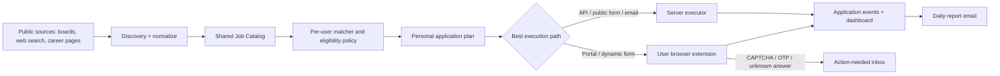

# Grindly autonomous internship application system

## Purpose

Build the product promised to a user:

1. The user completes setup once: resume, contact details, education, skills, eligibility facts, preferences, application answers, daily limit, and consent.
2. Grindly continuously discovers internships from many sources, decides whether each is a suitable and safe match, and creates a personal application plan.
3. It applies automatically wherever the destination permits a normal submission. This includes employer-hosted forms, supported ATS sites, email applications, and browser-driven applications in the user's own logged-in browser.
4. The dashboard updates with every attempt and submitted application. A daily email reports submitted applications, failures, and items that need the user.

This must support all career fields selected by a user. “No domain restriction” means do not hard-code job fields or restrict discovery to a small employer list. It does **not** mean bypassing a website's CAPTCHA, OTP, payment, consent, or anti-bot controls.

## Product contract

### What is automatic

- Matching against each user's preferences and eligibility.
- Discovery, normalization, de-duplication, scam checks, ranking, queuing, retries, and daily limits.
- Submission through an API, public Google/Microsoft form, supported ATS workflow, or a form in the user's own browser when no human-verification gate appears.
- Personalized resume selection, cover letter generation, and answers from user-approved facts.
- Dashboard updates and a daily email summary.

### What must pause for the user

- CAPTCHA, OTP, MFA, identity verification, payment, signed legal declaration, or an answer that is unknown/ambiguous/high-risk.
- A portal that requires the user to create or refresh a login session.

The browser extension must show a clear **Action needed** card, take no further action, and resume the exact task after the user completes the gate. Never solve or outsource CAPTCHA/OTP, never invent eligibility facts, and never submit an application with an unanswered mandatory question.

## Current codebase audit

The implementation extends existing work; do not replace it with a second system.

| Existing part | Current responsibility | Required change |
| --- | --- | --- |
| `src/app/onboarding/page.tsx` | Resume, preferences, auto-apply activation | Expand profile and consent collection; add readiness validation. |
| `src/app/api/trial/activate/route.ts` | Makes a user active | Reject activation until profile, consent, resume, and daily limit are valid. |
| `agent/worker.py` | Finds, scores, queues, applies, reports | Split into discovery, planning, and execution stages; create browser tasks rather than treating board sites as server-submittable. |
| `agent/sweep.py` | Per-user daily scheduling | Schedule discovery independently from submission; enforce user timezone and a non-rollover daily cap. |
| `agent/run_queue.py` | DB-backed locking/retries | Add task leases and browser-executor task types. |
| `agent/resolver.py` | Routes destination to Google form, email, ATS, platform | Add canonical destination resolution and browser task fallback. |
| `agent/channel_google_form.py`, `agent/channel_email.py`, `agent/channel_ats.py` | Existing direct submitters | Keep and harden as Tier A executors. |
| `extension/manifest.json` and extension code | Currently manual final-click model | Replace with a user-owned browser executor, authenticated task lease, safe field filling, status reporting, and human-gate detection. |
| `src/app/api/extension/kit/route.ts` | Extension data endpoint | Replace/extend with scoped profile kit and task APIs. |
| Dashboard and reports UI | Displays counts and reports | Add live application timeline, queue status, action-needed inbox, and daily report detail. |
| Prisma schema / `prisma/schema.prisma` | Users, jobs, applications and supporting records | Add source observations, task leases, application events, answer vault, and browser-session metadata. |

The repository already has the two essential services. Local startup must run `agent/worker.py --serve` and `agent/sweep.py --serve`; production Docker Compose must keep both services running continuously. The prior invalid `--loop --mode mock` startup path must not be restored.

## Architecture to implement

### Core design decisions

1. **One global job catalog, separate user applications.** A listing is collected once and can be matched to many users. Each user has their own score, resume, answers, quota use, status, and proof of submission. Never share a user's resume, answers, cookies, or application record with another user.
2. **Source discovery is separate from applying.** Boards are useful supply signals. A resolver should prefer the employer's official apply URL, direct form, ATS, or email destination. If only a portal page exists, create a browser task.
3. **Server applies only where it can reliably submit.** Browser-only sites use the user's own browser extension and session. This avoids pretending a cloud worker can safely operate every authenticated platform.
4. **The browser extension is a task executor, not a scraping bot.** It processes a leased, user-specific task, fills only approved fields, asks for help at gates, and returns structured events and evidence.
5. **Default to a daily cap, not a monthly target.** A 15/day limit means at most 15 submitted applications in an IST calendar day and at most 450 in a 30-day period. Unused quota never carries over. Count only confirmed submissions, not failed attempts or action-needed tasks.

## State machines

### Job state

`discovered -> normalized -> resolved -> active | expired | rejected_scam | duplicate`

An active job may be globally shared. Store all source observations so an expired board post does not erase a still-valid official application URL.

### Personal application state

`candidate -> eligible -> queued -> leased -> filling -> submitted`

Terminal alternatives:

`ineligible | skipped_duplicate | skipped_quota | expired | rejected_safety | failed_retryable | failed_final | awaiting_human | cancelled`

Only `submitted` increments the user's daily applied count. `awaiting_human` consumes no quota. A task may be retried only when idempotency checks prove no previous submission occurred.

### Browser task state

`queued -> leased -> navigating -> filling -> awaiting_submit -> submitted`

Alternatives:

`awaiting_human | lease_expired | retryable_error | final_error | cancelled`

A lease is short-lived (10 minutes). The extension heartbeats every 30 seconds. On expiry, return the task to `queued` only after confirming it did not submit.

## Data model and migration

Review the existing Prisma names before editing, then add equivalent models/columns. Keep existing `Job` and `Application` records as the canonical catalog and user application records.

### Add or extend these entities

| Entity | Key fields | Index/constraint |
| --- | --- | --- |
| `JobSourceObservation` | `jobId`, `source`, `sourceUrl`, `sourceJobId`, raw title/company/location, `seenAt`, `expiresAt`, `rawHash` | unique `(source, sourceJobId)` when ID exists; index `jobId, seenAt`. |
| `JobDestination` | `jobId`, `kind` (`google_form`, `email`, `ats`, `browser`, `manual`), canonical URL/email, `confidence`, `verifiedAt` | unique `(jobId, canonicalUrl)`. |
| `ApplicationPlan` | `userId`, `jobId`, `score`, eligibility snapshot JSON, selected resume, answer-set version, priority, status | unique `(userId, jobId)`, index `(userId, status, priority)`. |
| `ApplicationEvent` | `applicationId`, `type`, actor (`worker`, `extension`, `user`), safe metadata JSON, timestamp | index `(applicationId, createdAt)`. This is the audit trail and dashboard timeline. |
| `BrowserTask` | `applicationId`, encrypted task payload reference, state, lease token hash, lease expiry, heartbeat time, retry count, evidence URL/hash | unique active task per application; index `(state, leaseExpiresAt)`. |
| `UserAnswer` | `userId`, normalized question key, encrypted answer, source (`setup`, `user`, `generated`), approval status, review time | unique `(userId, questionKey)`. |
| `UserProfileReadiness` | per-field completion, consent version/time, daily limit, timezone, auto-apply enabled | one row per user or fields on existing profile. |
| `DailyUsage` | `userId`, local-date, submitted count, attempted count | unique `(userId, localDate)`. |

### Privacy rules

- Encrypt resumes, contact data, answers, and any browser-session secret at rest using the application secret manager/KMS. Do not put these values in job events, logs, error messages, analytics, or email bodies.
- The extension never uploads browser cookies. It uses the browser's existing session locally. Backend task payloads contain only the facts and files needed for that application.
- Store submission proof as URL, timestamp, portal application ID, and a redacted screenshot/hash if allowed. Do not store page HTML containing personal data.
- Add retention jobs: delete raw source payloads after 30 days, browser task evidence after 90 days, and user data immediately on account deletion unless legal retention applies.

### Migration procedure

1. Add nullable fields/new tables in a backwards-compatible Prisma migration.
2. Backfill one `ApplicationPlan` for existing non-terminal applications.
3. Deploy code that writes both old and new status/event data.
4. Verify metrics for 48 hours.
5. Make new flow authoritative, then remove temporary dual-write code in a later release.

Never run a destructive user purge or schema reset as part of this feature rollout.

## API contract

All routes require authenticated user ownership. Admin routes require an admin role and are read-only unless a separate explicit admin action is added.

| Endpoint | Method | Responsibility |
| --- | --- | --- |
| `/api/profile/readiness` | `GET`, `PUT` | Return/update setup completeness, consent, daily cap, timezone, and auto-apply toggle. |
| `/api/application-plans` | `GET` | Paginated queue, score explanation, eligibility result, chosen destination, and status. |
| `/api/application-plans/:id` | `PATCH` | User may pause, cancel, prioritize, or require review before submit. |
| `/api/application-events` | `GET` | Timeline for dashboard and report rendering. |
| `/api/action-needed` | `GET`, `POST` | Display/resume browser tasks blocked on a human gate. |
| `/api/extension/session` | `POST` | Exchange authenticated extension identity for a short-lived scoped token. |
| `/api/extension/tasks/claim` | `POST` | Lease one task for the signed-in user and browser. No task if a human gate is pending. |
| `/api/extension/tasks/:id/heartbeat` | `POST` | Extend a valid lease; no profile data returned. |
| `/api/extension/tasks/:id/event` | `POST` | Append validated structured event and status transition. |
| `/api/extension/tasks/:id/complete` | `POST` | Mark submitted/failed only with allowed proof fields and idempotency token. |
| `/api/reports/daily` | `GET` | Current user's rendered daily summary and historical reports. |

Use Zod validation for every Next.js route. Reject client-supplied status transitions unless they match the server's state machine. Use a task-specific idempotency key on claim, submit, and complete requests.

## Matching, eligibility, and ranking

### Setup data required before activation

Mandatory:

- Current resume and full name/contact information.
- Education, graduation month/year, location/work authorization, and internship availability.
- Target roles/skills, work mode/location preferences, stipend minimum if desired, and excluded employers/roles.
- Daily submission limit, timezone, and explicit auto-apply consent.
- Confirmation that all supplied facts are accurate and that Grindly may submit applications using them.

Optional but high-value:

- Portfolio, GitHub/LinkedIn, preferred resume variants, cover-letter style, disability/veteran/other voluntary disclosure choices, referral information, and default responses for common questions.

Activation must remain disabled until mandatory data and consent exist. Missing optional answers must cause an `awaiting_human` task only if a specific application requires one.

### Eligibility policy

For each candidate, calculate and store a snapshot:

- Hard filters: internship status, date availability, graduation requirements, work authorization, geography/work-mode, required skills where explicitly mandatory, user exclusions, expired deadline, and daily cap.
- Safety filters: scam patterns, up-front payment, requests for credentials/OTP, mismatched company email/domain, malware/download links, duplicate listing, and known blocked employers.
- Soft ranking: role/skill overlap, experience relevance, location, stipend, recency, company preference, and historical user preference signals.

Use deterministic rules for hard filters. LLM output may summarize a listing or draft a cover letter, but may never be the sole reason to claim eligibility or fill a factual answer. Preserve score factors so the dashboard can explain “why this was chosen.”

### Planning algorithm

Run at least every 6 hours for active users; run immediately after setup completion or a preference change.

1. Load active shared jobs observed in the last 14 days and fetch new source observations.
2. Normalize company/title/location/deadline and merge duplicates using canonical application URL, source ID, and fuzzy title/company/location comparison.
3. Resolve the best apply destination in order: official employer form, direct email, supported ATS, user-browser page, then manual-only.
4. For each active user, reject hard-ineligible/safety-failed jobs, score the rest, and upsert `ApplicationPlan(userId, jobId)`.
5. Pick only the highest-priority plans that can fit today's remaining cap. Prefer fresher listings and closer deadlines, but never bump a plan already leased/submitting.
6. Send direct destinations to the server queue and browser destinations to `BrowserTask`.

The shared catalog can serve different users in the same field, but application plans must remain isolated. For example, one software internship listing can match ten users, each with their own resume and answers, and yield ten separate submissions.

## Discovery strategy

Do not remove Internshala, Indeed, LinkedIn, Naukri, Unstop, Greenhouse, Lever, or Ashby simply because they have uneven inventory. Treat them as source adapters with separate health metrics.

### Source tiers

1. **Public structured sources:** Greenhouse, Lever, Ashby and public career pages. Poll APIs/pages where permitted.
2. **Job boards:** collect listings only where access and terms allow. Do not use credential sharing or CAPTCHA bypass.
3. **Search provider:** add a configurable provider such as Serper/Google Programmable Search. Query combinations of user role/location/India internship terms and company career pages; cache results and impose a global budget. Store only result metadata until the resolver verifies a destination.
4. **Employer-owned destinations:** crawl only allowed public pages, obey robots/rate limits, and prefer their actual apply link over a board's redirect.
5. **User-supplied/referral links:** let a user paste a job URL; run the same resolver, safety checks, planning, and browser/direct execution flow.

Every adapter must implement the same interface: `discover(cursor) -> observations`, with source name, stable external ID, URL, timestamp, and source health. A failed adapter must not stop the overall worker.

## Execution paths

### Tier A: direct server submission

Keep the existing Google Form, email, and ATS channels but give each executor:

- A destination capability check before queueing.
- An idempotency key derived from `userId + jobId + destination + application version`.
- A pre-submit validation that all required profile fields and approved answers exist.
- A submission receipt parser and one clear success event.
- Retry only network/5xx errors. Do not blindly retry an ambiguous post; first query the destination/receipt if possible.

### Tier B: browser extension submission

Implement this before claiming site-agnostic automation.

1. Use Chrome/Edge Manifest V3, service worker, content scripts, alarms, and the existing extension authentication route.
2. The user explicitly enables “Autopilot” per browser profile. Show account email, connected state, last heartbeat, and a Pause button.
3. On each alarm, the extension claims one task for the signed-in Grindly user. Tasks are scoped to the permitted host and expire quickly.
4. The content script opens/navigates only to the task URL, detects forms, maps common fields to a signed profile kit, attaches the selected resume, fills approved answers, and validates the page.
5. Use a layered mapper: stable selectors/site adapters first, semantic label/name/ARIA matching second, visual/LLM interpretation only as a non-sensitive suggestion. Never use vision/LLM to infer SSN, gender, disability, salary, legal authorization, or other sensitive answers.
6. Submit only if all required fields are filled from approved sources and the site has no human gate. Capture success confirmation before emitting `submitted`.
7. Detect CAPTCHA, OTP, MFA, login/logout, required new question, payment, accessibility challenge, or a changed form. Emit `awaiting_human` with a short explanation and stop.
8. After the user handles the gate in their local browser, they click Resume. The extension reclaims or resumes the task and revalidates the page before submitting.

Build site adapters incrementally. The generic mapper is a fallback, not proof that every portal works. Track completion rate by host and automatically downgrade a host to human-review-only after repeated failures.

### Tier C: manual-only destinations

When execution is not allowed or reliable, show it in the user's action-needed inbox with job facts, match explanation, prepared documents/answers, source link, and a “Mark applied” control. Do not call this an automatic submission in dashboard totals.

## Dashboard and daily report

### Dashboard changes

Add a single “Autopilot” section with:

- Toggle/status: paused, setup incomplete, active, waiting for browser, or needs action.
- Today: submitted count / daily limit, remaining count, queued count, and next planned run.
- Lifetime and 30-day submitted count.
- Application timeline showing company, role, source, destination, submitted timestamp, and receipt link when available.
- Queue with match score and plain-English eligibility explanation.
- Action-needed inbox with deep link that tells the extension exactly which browser tab/task to resume.
- Browser health: extension connected, last heartbeat, and re-authentication prompt.

Use “submitted” only for confirmed successful applications. Keep “attempted”, “queued”, and “needs action” separately so counts never mislead users.

### Daily report

Generate once after the user's local-day application window closes, default 7:00 PM in the user's selected timezone. It must be idempotent per user/local date.

Email/in-app report sections:

- Submitted today: count and a table of company, role, applied time, source, and receipt/link.
- Still queued: count and top reasons.
- Needs your action: task links and reason, such as CAPTCHA/OTP/new mandatory answer.
- Skipped: cap reached, duplicate, expired, ineligible, or safety rejection counts.
- Tomorrow's plan: remaining suitable queue and a link to pause/change preferences.

If email is disabled or fails, record an in-app notification and retry delivery separately. The daily report must not rerun applications.

## Implementation phases

### Phase 0: safety baseline and configuration

Files: `.env.example`, worker config modules, `agent/tests/test_safety.py`, README, Docker Compose/service manifests.

- Define feature flags: `AUTOPILOT_ENABLED`, `BROWSER_EXECUTOR_ENABLED`, `SEARCH_DISCOVERY_ENABLED`, `DIRECT_SUBMIT_ENABLED`, `DAILY_REPORT_ENABLED`, and per-source flags.
- Default new users to setup-incomplete and autopilot disabled until consent.
- Add structured logs/metrics without PII: source health, plans created, executor outcomes, task lease expiry, cap enforcement, and report delivery.
- Confirm production starts `web`, `worker --serve`, and `sweep --serve`; add health checks for each.

Acceptance: flags can disable any executor without losing queue state; a stopped browser extension never causes server-side portal submission.

### Phase 1: profile readiness, consent, and answer vault

Files: `prisma/schema.prisma`, migration, onboarding page/API, activation route, profile API, tests.

- Add required setup fields and a visible completion checklist.
- Store consent version/time and allow revocation; revocation pauses active plans and cancels unleased tasks.
- Add answer-vault UI with explicit approval for sensitive/default answers.
- Enforce readiness on activation and again immediately before execution.

Acceptance: a user cannot enable autopilot with missing mandatory data; changing a fact updates subsequent plans but does not rewrite the audit history of prior applications.

### Phase 2: catalog, planning, and quota correctness

Files: Prisma migration, `agent/worker.py`, `agent/sweep.py`, `agent/run_queue.py`, resolver, unit/integration tests.

- Introduce source observations, canonical jobs/destinations, application plans, daily usage, and events.
- Move matching into an idempotent planning function that can be rerun safely.
- Enforce unique `(userId, jobId)` plans and transactional daily-cap reservation immediately before final submit. Release a reservation if submission is definitively not made.
- Add multi-user tests proving one job can queue independently for two users and never leaks profile data.

Acceptance: for a limit of 15, concurrent workers can never produce 16 submitted applications for one user/day; two users can apply to the same job with isolated records.

### Phase 3: discovery and resolver expansion

Files: new source adapter modules under `agent/`, `agent/worker.py`, `agent/resolver.py`, configuration, fixtures/tests.

- Convert each current platform into a bounded adapter with cursor/rate-limit/error health behavior.
- Add search-provider adapter behind a key/feature flag, cache results, and enforce daily cost/query budget.
- Resolve board listing URLs toward official destinations and classify the executor path.
- Add scan detection, source trust scoring, robots/terms-aware rate limits, and stale-job expiry.

Acceptance: a failed source produces metrics and retries later without blocking other sources; resolver test fixtures cover direct form, email, ATS, browser page, and unsafe destination.

### Phase 4: direct executor hardening

Files: existing channel modules, queue worker, application event API/UI, tests with mocked endpoints.

- Standardize executor interface: `validate`, `prepare`, `submit`, `verify`, `result`.
- Add idempotency, receipt verification, retry classification, typed failure reasons, and redacted audit events.
- Ensure all success events update plans, applications, daily usage, and dashboard in one transaction/outbox flow.

Acceptance: replaying a queue message cannot create a duplicate email/form/ATS submission; a failed receipt check stays non-submitted.

### Phase 5: browser extension executor

Files: `extension/`, extension APIs, Prisma models, worker task dispatcher, dashboard action-needed UI, E2E fixtures.

- Implement extension login/session exchange and signed task leases.
- Implement generic form mapper plus initial adapters for the highest-volume supported sites discovered from telemetry.
- Build human-gate detection/resume flow, task heartbeats, safe evidence capture, pause/revoke behavior, and host failure circuit breaker.
- Add extension integration tests using local fixture pages for normal form, required unknown question, OTP/CAPTCHA marker, submission success, and changed selector.

Acceptance: a normal fixture form is filled and submitted end-to-end; a CAPTCHA fixture never submits and becomes action-needed; revoking consent invalidates the next extension API call.

### Phase 6: dashboard, reports, and operations

Files: dashboard routes/components, report generator/notifier, worker scheduling, email templates, monitoring docs/tests.

- Render counts from application events/statuses, not optimistic UI state.
- Build daily report aggregation and idempotent email/in-app delivery.
- Add admin operational view: source health, submission rate by destination, queue lag, extension connection count, and failures. It must never expose one user's resume/answers to another user.
- Add alerting for stuck queues, no worker heartbeat, report failures, abnormal submit rate, and source adapter failure spikes.

Acceptance: a test user receives one report per local day; dashboard count and report count match; report failure does not stop planning/execution.

## Test plan

Run existing tests plus these new suites before every release.

- Unit: eligibility policy, scoring, duplicate merge, destination classifier, cap transaction, state transitions, retry policy, redaction, and report aggregates.
- API: authorization for every route, invalid transition rejection, task lease theft prevention, expired lease recovery, and idempotency replay.
- Worker integration: two users/same job, user with 15-cap, source outage, unsafe listing, missing answer, and direct executor ambiguous timeout.
- Extension E2E: setup -> claim -> fill -> submit -> event -> dashboard/report. Repeat for CAPTCHA/OTP and mandatory unknown answer, verifying no submission.
- Load: at least 1,000 catalog jobs, 100 active users, and concurrent planners/workers without duplicate plans/submissions.
- Security: dependency scan, secret scan, authorization regression tests, encrypted-data access tests, and log inspection for PII.

Required commands must be documented in README/CI. At minimum preserve the current Python agent tests, TypeScript policy tests, and `npm run build`.

## Rollout and rollback

1. Deploy migrations and observability with all new executor flags off.
2. Enable catalog/planning for internal admin/test accounts. Compare planned jobs with manual review; do not submit.
3. Enable direct executors for a small opt-in cohort and verify receipts/cap counts.
4. Enable browser extension for staff/test accounts on two supported hosts.
5. Gradually enable more users and hosts based on verified submit rate and low human-gate/error rate.
6. Only then enable search discovery and expand source budget.

Rollback is flag-based: disable browser/direct submission first, preserve plans/events/tasks for inspection, and leave dashboard/reporting active. Do not delete applications or user data as a rollback mechanism.

## Definition of done

The feature is complete only when all statements below are true:

- A new user can finish setup, give consent, activate autopilot, and see a valid readiness state.
- The system finds applicable internships across configured sources without a hard-coded field/employer allowlist.
- One job can serve multiple users while every user's application is personalized and private.
- Eligible jobs are queued in priority order and never exceed the user's daily submitted limit, including concurrent worker execution.
- A supported direct destination or normal browser form is submitted automatically and has a receipt/event.
- CAPTCHA, OTP, login, unknown answers, and sensitive/legal prompts pause safely and are visible to the user; they are never bypassed or fabricated.
- Dashboard submitted counts are backed by confirmed submissions and the daily email is sent once per user/day with accurate details.
- Worker, sweep, queue, extension, source adapters, and reports have automated tests, health checks, metrics, flags, and a documented rollback path.

## Suggested implementation order for an agent

Do not start with browser automation. Complete phases 0 through 4 first, because the catalog, personalized plan, cap transaction, receipt semantics, and action-needed model are required whether the executor is an API, a form, or a browser. Then build the extension against stable task APIs. Ship each phase behind flags, with tests and a migration review before moving on.
